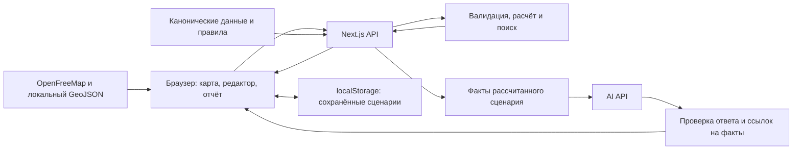

<a name="project"></a>
<div align="center">

# 🏙️ Аким на 5 часов

**Учебный симулятор управления Астаной: пять решений, ограниченный бюджет и измеримые последствия для города.**

Распределите **10 млрд ₸**, соберите городской план и оцените, как он изменит жизнь пяти районов.
3D-карта, воспроизводимый расчёт, поиск лучшего плана и объяснение от **GPT-6 Sol**.

📦 **[Репозиторий](https://github.com/BAITC-Hacks/hack-5db21a28-astra-the-best)** · 🚀 **[Запуск](#setup)** · 🧪 **[Сценарий для жюри](#demo)**

<br/>

**Интерфейс и карта**


**Сервер и AI**


**Проверки**


</div>

---

## Содержание

1. [Название проекта](#project)
2. [О проекте: проблема и аудитория](#about)
3. [Что реализовано](#features)
4. [Как работает решение](#flow)
5. [Технологии](#stack)
6. [Архитектура проекта](#architecture)
7. [Установка и запуск](#setup)
8. [Как проверить решение](#demo)
9. [Данные и интеграции](#data)
10. [Ограничения](#limits)
11. [Развёрнутая версия](#deployment)

---

<a name="about"></a>

## 02 · О проекте: проблема и аудитория

Городской бюджет ограничен: строительство школы, улучшение транспорта и модернизация коммунальных сетей конкурируют за одни ресурсы. При выборе важно учитывать не только пользу отдельной меры, но и сроки, побочные эффекты и различия между районами.

«Аким на 5 часов» помогает студентам, участникам образовательных программ и жителям, интересующимся городским управлением, исследовать эти компромиссы. Пользователь выступает в роли акима: распределяет **10 млрд ₸ условного бюджета**, выбирает **ровно пять мероприятий** и получает карту изменений, индекс качества жизни **Astana Quality of Life Score** и AI-объяснение результата.

**Данные и эффекты синтетические. Это учебная модель, а не прогноз реальной городской политики.** Горизонт расчёта — восемь условных кварталов (два года). «5 часов» — название кейса и время работы над ним на хакатоне; игрового таймера нет.

---

<a name="features"></a>

## 03 · Что реализовано

- **Карта всей Астаны:** объёмные здания, пять игровых зон, выбор района, слои десяти показателей, метки мероприятий и режим «До / После».
- **Редактор городского плана:** 14 мероприятий по пяти направлениям — транспорт, экология, социальная инфраструктура, безопасность и городские сервисы. Видны цена, район действия, задержка эффекта, положительные и отрицательные изменения.
- **Контроль правил в интерфейсе и на сервере:** пять уникальных мер, бюджет до 100 единиц, максимум две меры одного направления, проверка районов и несовместимостей. Меры можно удалять и заменять.
- **Воспроизводимый расчёт и отчёт:** Score до и после, все 50 районных показателей, слабейший район, критические значения и синергии — дополнительные эффекты сочетаний мер.
- **AI-анализ:** сильные стороны, риски, последствия и рекомендация на основе серверного расчёта. Для этой функции нужен API-ключ; ошибка AI не удаляет числовой результат.
- **Поиск лучшего плана:** полный перебор допустимых сочетаний мер и районов на сервере, затем AI-объяснение найденного варианта. Применение плана — отдельное действие пользователя.
- **Сравнение вариантов:** сохранение до шести сценариев в текущем браузере и отдельный поиск улучшения заменой одной меры или её района.
- **Экспорт:** автономный HTML-отчёт для просмотра и печати в PDF, а также JSON с точными числами.
- **Обучение при первом входе:** подсказки по реальным действиям, возможность пропустить или повторить обучение. Режимы «Город / Отчёт» сохраняют текущий сценарий при переключении.

---

<a name="flow"></a>

## 04 · Как работает решение

1. **Входные данные.** Приложение загружает одинаковый для всех набор: показатели пяти районов, каталог мер, бюджет и правила. Загружать собственный файл не требуется.
2. **Выбор.** Пользователь изучает карту и собирает пять решений. Для районной меры выбирает район; общегородская действует во всех пяти зонах и оплачивается один раз.
3. **Расчёт.** После нажатия «Рассчитать сценарий» сервер проверяет выбор, берёт цены и эффекты из канонического набора и рассчитывает результат с учётом задержек, синергий и критических показателей.
4. **Результат.** Открывается отчёт с изменением Score и районных показателей. Можно вернуться на карту, сравнить «До / После» и отредактировать план.
5. **Объяснение и сравнение.** По кнопке «Получить AI-анализ» модель объясняет уже рассчитанные факты. Сценарий можно сохранить, сравнить с другим или выгрузить в отчёт.

Эффект меры с задержкой `L` кварталов учитывается с долей `(8 − L) / 8`. После сложения эффектов и синергий каждый показатель ограничивается диапазоном 0–100. Чем выше показатель, тем лучше; значение строго ниже 40 считается критическим.

```text
Score = 0,7 × средний балл районов с учётом долей населения
      + 0,3 × балл слабейшего района
      − количество критических показателей
```

Балл района — взвешенная сумма его десяти показателей. AI не вычисляет и не меняет Score: одинаковые решения всегда дают одинаковые числа. В расчётах используются исходные **100 единиц бюджета**, в интерфейсе **1 единица = 100 млн ₸**. Это условные ассигнования, не реальные сметы; подробнее — [шкала бюджета](docs/BUDGET.md).

---

<a name="stack"></a>

## 05 · Технологии

| Компонент | Технологии и назначение |
|---|---|
| Язык и среда | TypeScript 6, Node.js 22, npm 10 |
| Приложение и сервер | Next.js 16.3.6, React 19.3.0, App Router и серверные Route Handlers |
| Интерфейс | CSS Modules, адаптивная вёрстка |
| Карта | MapLibre GL JS 6.11.0, WebGL, GeoJSON, подложка OpenFreeMap |
| Проверка данных | Zod 4: схемы запросов и ответов AI |
| AI | OpenAI Chat Completions API; модель по умолчанию `gpt-6-sol`, `reasoning_effort: none`, до 2500 токенов ответа |
| Тесты | Vitest 5, Testing Library, Playwright 1.63 с Google Chrome |
| Контроль качества | TypeScript, ESLint 9 |
| Подготовка географии | Python + Shapely для границ, Node.js для геоориентиров; при обычном запуске не нужны |

Точные версии зависимостей зафиксированы в [package.json](package.json) и [package-lock.json](package-lock.json). База данных, регистрация и отдельный backend-сервис для локального запуска не требуются.

---

<a name="architecture"></a>

## 06 · Архитектура проекта

Одно приложение Next.js содержит браузерный интерфейс и серверный API. Карта и отчёт используют общее состояние выбранного плана.



| Каталог | Ответственность |
|---|---|
| `src/data/`, `src/contracts/` | Исходные данные, версия/hash набора, общие типы и контракты |
| `src/domain/` | Проверка правил, чистый расчёт, поиск оптимума и локальных улучшений |
| `src/app/api/` | HTTP-маршруты сценария, расчёта, оптимизации и анализа |
| `src/server/ai/` | Подготовка фактов, вызов модели, проверка структуры и чисел ответа |
| `src/features/`, `src/app/AppShell.tsx` | Карта, редактор, отчёт, обучение, сравнение и экспорт; общее состояние интерфейса |
| `public/geo/` | Подготовленная геометрия пяти игровых зон |
| `tests/` | Проверки данных, формул, API, интерфейса и браузерных сценариев |

API предоставляет `GET /api/scenario`, `POST /api/simulate`, `POST /api/optimize` и `POST /api/analyze`. Сервер сам рассчитывает стоимость и результат; переданные клиентом цены или готовый Score не принимаются. Перед AI-запросом сценарий пересчитывается заново. Ключ провайдера хранится только на сервере. Подробности: [контракт API](docs/API.md), [устройство поиска оптимума](docs/OPTIMIZER.md).

Особенность подхода — проверяемая цепочка: **694 395 допустимых сценариев → максимум канонического Score → факты расчёта для AI → объяснение и сравнение пользователем**. Полный поиск выполняет алгоритм, а модель объясняет последствия; независимая проверка контрольного примера и тесты поиска позволяют воспроизвести числовой результат. Это сочетание показывает и лучший общий балл, и районные компромиссы, которые он скрывает.

---

<a name="setup"></a>

## 07 · Установка и запуск

Нужны **Git**, **Node.js `>=22.14.0 <23`**, **npm `>=10 <11`** и браузер с WebGL. Интернет нужен для установки пакетов, подложки карты и AI. Основная проверенная среда — Windows / PowerShell.

### 1. Получить проект и зависимости

```powershell
git clone https://github.com/BAITC-Hacks/hack-5db21a28-astra-the-best.git
cd hack-5db21a28-astra-the-best
node --version
npm.cmd --version
npm.cmd ci
```

Если репозиторий уже открыт локально, выполняйте команды из его корня, начиная с проверки версий.

### 2. Подготовить окружение

При первом запуске скопируйте шаблон; существующий файл с ключом перезаписывать не нужно:

```powershell
Copy-Item .env.example .env.local
```

| Переменная | Значение по умолчанию / назначение |
|---|---|
| `AI_API_KEY` | Пустая; для AI укажите действующий ключ провайдера с доступом к выбранной модели |
| `AI_BASE_URL` | `https://api.openai.com/v1` — адрес API |
| `AI_MODEL` | `gpt-6-sol` — модель анализа |
| `AI_TIMEOUT_MS` | `30000` — время ожидания AI в миллисекундах |
| `AI_MAX_REQUESTS_PER_MINUTE` | `10` — серверное ограничение частоты запросов анализа на клиента |

Файл `.env.local` исключён из Git. После изменения переменных перезапустите сервер. Пример альтернативной настройки NVIDIA находится в [.env.example](.env.example); ключ, адрес и модель должны соответствовать одному провайдеру.

**Без ключа доступны редактор, расчёт, поиск лучшего плана, сравнение и экспорт.** При запросе AI появится сообщение об отсутствии настройки; шаблонный текст не подставляется вместо анализа.

### 3. Запустить приложение

```powershell
npm.cmd run dev
```

Откройте [http://127.0.0.1:3000/](http://127.0.0.1:3000/). Сервер работает, пока открыта команда; остановка — `Ctrl+C`.

В macOS/Linux используйте `npm` вместо `npm.cmd`, а для копирования шаблона — `cp .env.example .env.local`.

### 4. Сборка для production и проверки

Для запуска production-сборки остановите dev-сервер, затем выполните:

```powershell
npm.cmd run build
npm.cmd run start
```

Адрес останется [http://127.0.0.1:3000/](http://127.0.0.1:3000/). Проверки кода и расчётов запускаются отдельно:

```powershell
npm.cmd run typecheck
npm.cmd run lint
npm.cmd test
```

Для браузерных проверок установите **Google Chrome** и выполните:

```powershell
npm.cmd run test:e2e -- --reporter=line --workers=2
```

Тесты явно используют `channel: 'chrome'`: одного bundled Chromium недостаточно. Playwright поднимает dev-сервер автоматически, если порт 3000 свободен; уже работающий локальный сервер переиспользуется.

---

<a name="demo"></a>

## 08 · Как проверить решение: сценарий для жюри

После запуска можно повторить этот пример без API-ключа.

1. На первом экране нажмите **«Освоюсь самостоятельно»** или пройдите обучение.
2. В режиме **«Город»** откройте **«План · 0/5»**. Оставьте фильтр направлений на всех направлениях.
3. Выберите **Нуру** и добавьте M7, M8, M10. Добавьте общегородскую M12 — район для неё не нужен. Затем выберите **Сарыарку** и добавьте M5.

| Мера в каталоге | Район | Цена в модели | Цена в интерфейсе |
|---|---|---:|---:|
| M7 — Школа + детсад (модульное строительство) | Нура | 24 | 2,4 млрд ₸ |
| M8 — Центр семейного здоровья / поликлиника | Нура | 20 | 2 млрд ₸ |
| M10 — Освещение и камеры (расширение Safe City) | Нура | 12 | 1,2 млрд ₸ |
| M12 — Единая цифровая платформа обращений | Весь город | 14 | 1,4 млрд ₸ |
| M5 — Перевод частного сектора на чистое топливо | Сарыарка | 25 | 2,5 млрд ₸ |

Нажмите **«Рассчитать сценарий»**. Откроется отчёт со следующими результатами:

| Проверка | Ожидаемый результат |
|---|---|
| Расходы / остаток | **9,5 млрд ₸ / 500 млн ₸** — 95 / 5 единиц модели |
| Исходный Score | **52,55768**; в интерфейсе **52,56** |
| Итоговый Score | **56,54307**; в интерфейсе **56,54** |
| Изменение | **+3,98539**; в интерфейсе **+3,99** |
| Критические показатели после расчёта | **0** |
| Синергия | M10 + M12: **+2 к безопасности улиц (B1) в Нуре** |

Далее проверьте дополнительные возможности:

- **AI:** при настроенном ключе нажмите «Получить AI-анализ». Появятся сильные стороны, риски, последствия и совет. Без ключа отобразится ошибка настройки, а расчёт останется доступен.
- **Сравнение:** в блоке «Сравните свои решения» назовите и сохраните текущий сценарий. Измените меру или район, пересчитайте и сравните варианты. «Найти проверяемое улучшение» ищет замену одного решения.
- **Экспорт:** скачайте «Скачать отчёт · HTML / PDF» или «Скачать данные · JSON». Для PDF откройте HTML и выберите печать → «Сохранить как PDF».
- **Контроль правил:** вернитесь к плану и удалите одну меру. С четырьмя решениями итоговый расчёт недоступен; добавление пятой допустимой меры восстанавливает возможность расчёта.
- **Полный поиск:** в редакторе нажмите «Найти лучший план с ИИ». Для текущего набора `astana-s2-v1` поиск проверяет **694 395** допустимых сценариев и находит Score **57,236735** (на экране **57,24**) при цене **9,8 млрд ₸**. Кандидат доступен даже при ошибке AI и заменяет черновик только после «Применить лучший план». Состав и проверка — в [описании оптимизатора](docs/OPTIMIZER.md).

Точные числа контрольного примера проверяются существующими тестами:

```powershell
npm.cmd test -- tests/domain/simulation.test.ts tests/api/simulation.test.ts
```

Короткий маршрут первого запуска — [docs/DEMO.md](docs/DEMO.md). Для защиты используйте [демонстрацию пользы за 2–3 минуты](docs/JURY_DEMO.md): сравнение двух планов, цена улучшения и районные компромиссы. Выполненные проверки и незавершённые шаги сдачи отделены в [проверке выпуска](docs/RELEASE_CHECK.md).

---

<a name="data"></a>

## 09 · Данные и интеграции

| Источник / сервис | Что используется и когда |
|---|---|
| Задание хакатона S1–S3 | Синтетические показатели пяти районов, доли населения, цены, эффекты 14 мер и формула Score. Снимки и оригинальные ссылки: [источники требований](docs/sources/README.md) |
| Локальный набор `src/data/` | Одинаковые исходные данные для всех сессий, версия и SHA-256 hash; внешняя статистика во время расчёта не загружается |
| OpenStreetMap / Nominatim | Географическая основа и ориентиры. Снимки подготовлены заранее; приложение не вызывает геокодер при каждом запуске |
| OpenFreeMap | Подложка, тайлы и ресурсы карты загружаются через интернет, ключ карты не нужен |
| OpenAI API | По запросу получает факты рассчитанного сценария и выбранные меры; возвращает объяснение. Провайдер настраивается серверными переменными окружения |
| Браузерный `localStorage` | Явно сохранённые сценарии и состояние обучения; внешнее хранилище не используется |

Геометрия приведена к пяти зонам модели: **Есиль, Алматы, Сарыарка, Байконур, Нура**. В подготовленном снимке нынешние Алматы и Сарайшык объединены для соответствия заданию. Это игровое сопоставление, а не официальная карта административного деления. Источники, преобразования и атрибуция OpenMapTiles / OpenStreetMap перечислены в [docs/MAP_SOURCES.md](docs/MAP_SOURCES.md); геоданные распространяются на условиях ODbL.

---

<a name="limits"></a>

## 10 · Ограничения текущей версии

- **Фиксированная учебная модель:** пять районов, 14 мер, горизонт восемь кварталов. Нет живой городской статистики, реальных смет, случайных событий или полноценной симуляции транспорта. Метки на карте иллюстрируют решения и не обозначают утверждённые строительные площадки.
- **Принята трактовка подробных правил S2:** максимум две меры одного направления, поэтому допустимы пять решений из трёх и более направлений. Обязательного выбора по одной мере каждого направления нет. Расхождение с краткой формулировкой S1 зафиксировано в [docs/DECISIONS.md](docs/DECISIONS.md).
- **AI зависит от внешнего API:** нужны ключ, доступ к модели и сеть. Проверка структуры, ссылок на факты и чисел снижает риск ошибок, но не гарантирует правильность всех качественных выводов. Отклонённый ответ можно запросить повторно.
- **Сохранения локальные:** до шести сценариев в одном браузере. Несохранённый черновик и текущий отчёт теряются при перезагрузке. Нет аккаунтов, облачной синхронизации и совместного редактирования.
- **Карта зависит от WebGL и сети:** при недоступной подложке или WebGL доступен расчёт и отчёт, но полноценная 3D-карта недоступна. Полный офлайн-режим не реализован.
- **Оптимум относится только к этой модели и Score.** Он не означает лучшего результата по каждому показателю. Отдельный поиск замены одного решения не гарантирует глобальный максимум.
- **Ограничение частоты AI-запросов и кеш оптимизатора хранятся в памяти процесса.** Общее хранилище для нескольких серверных экземпляров не реализовано.
- **PDF получается печатью HTML:** отдельного серверного генератора PDF нет.

**Следующие шаги развития — пока не реализованы:**

1. Провести учебный пилот: сравнить, насколько участники понимают бюджет, лаги и районные компромиссы до и после работы с симулятором.
2. Добавить импорт версионированных наборов для других городов и откалибровать эффекты с профильными специалистами; проверять источники и неопределённость данных перед практическим использованием.
3. В отдельном режиме исследования сравнивать цели «максимум Score / меньшие расходы / равномерность улучшений», сохраняя исходную формулу и правила хакатона в основном режиме.

---

<a name="deployment"></a>

## 11 · Развёрнутая версия

По состоянию на **23 сентября 2026 года** публичный deployment в проекте не зафиксирован. Для проверки используйте локальный запуск: [http://127.0.0.1:3000/](http://127.0.0.1:3000/); этот адрес доступен только на компьютере с запущенным приложением.

Настройки Next.js, переменные окружения и проверка после публикации описаны в [инструкции для Vercel](docs/VERCEL.md). Успешный запуск на публичном адресе требует отдельной проверки.

[Репозиторий команды](https://github.com/BAITC-Hacks/hack-5db21a28-astra-the-best) · [Состояние сдачи и результаты приёмки](docs/DELIVERY.md)
